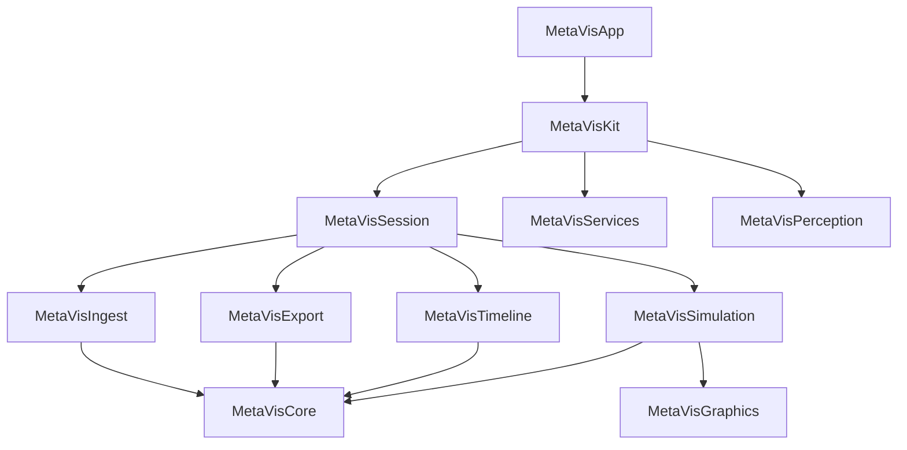

# MetaVisKit2: The Ideal Architecture

> **Philosophy**: Clean Room, Type-Safe, Protocol-Oriented, Testable.

## 1. System Manifesto
1.  **The Graph is Truth**: The entire state of the world is a `DAG` (Directed Acyclic Graph).
2.  **Devices do Work**: Cameras, Lights, and AI Generators are all `VirtualDevice`s.
3.  **Session $\neq$ Engine**: The *Session* manages State (Redux-style). The *Engine* executes Renders (Stateless).
4.  **Pixel Purity**: All media is converted to **ACEScg Linear** at the door.
5.  **EXR is Truth**: **OpenEXR (scene-linear ACEScg)** is the native/reference image format for internal frame dumps, deterministic reference renders, and loss-minimized project chaining. Other codecs are edge I/O and may be lower fidelity.

### 3. Core Concepts

#### A. The "Signal Path" & Hybrid Layers
*   **Unified Timeline**: Use a specialized "Signal Path" metaphor. Tracks carry **Signals** (Video, Audio, Generative Prompts, Control Data).
*   **Orchestration**: `MetaVisSession` orchestrates these signals, syncing generative "recipes" with deterministic assets.

#### A2. Evidence → Scene State → Compilation
Editing correctness requires a first-class intermediate representation between raw sensors and edit decisions.

*   **Evidence Pack**: deterministic time-indexed inputs produced at ingest time (sensors, transcripts, diarization, device streams).
*   **Scene State**: derived, higher-level summaries (intervals/events/identities) that drive edit planning and QC.
*   **Compilation**: `TimelineCompiler` consumes Timeline + Scene State to produce a render graph that binds the right inputs (masks, depth, tracks) at the right times.

See `Docs/specs/SCENE_STATE_DATA_DICTIONARY.md` for the intended contract.

#### B. Intelligent Devices & "Documentation as Code"
*   **Self-Documenting**: Every `VirtualDevice` must expose a `CapabilityManifest` containing educational context ("Why use this ISO?").
*   **Agent Integration**: The Agent reads this manifest to teach the user.
*   **Pluggable Renderers**: The Renderer behaves as a `VirtualDevice` (e.g., `ReferenceRenderDevice`, `MobileRenderDevice`) capable of being swapped based on intent.

#### C. Governance & Autonomy
*   **Dual-Layer Governance**:
    *   **App Level**: `UserPlan` controls project types/counts (Unlock Codes).
    *   **Project Level**: `ProjectLicense` controls export quality/permissions.
*   **Autonomy Tiers**: Monetization via "Agent Skills" (AutoColor, AutoEdit). The Engine is free; the "Virtual Crew" is paid.

#### D. Quality & Hardware
*   **Distributed Quality**: A `QualityProfile` propagates through the system (Scheduler -> Engine -> Export).
*   **Reference Renderer**: An ACEScg `rgba16Float` "God Mode" renderer using OpenEXR for loss-minimized project chaining.
*   **Hardware Maximization**: Strict assignment (Media Engine for Codecs, ANE for AI, GPU for Pixels). Zero-Copy enforcement.

### 2.6 Safety as a First-Class Signal
The system should compute an operation-specific "edit safety rating" timeline (safe/caution/unsafe) so that:
- agents and automation plan edits in valid regions
- QC gates can reject unsafe plans deterministically

This is the core defense against "AI has no eyes" regressions.

### 2.5 Quality Ladder (format tiers)
*   **Tier 0 (Reference / Native)**: OpenEXR (scene-linear ACEScg). Used for tests, internal interchange, and “truth” comparisons.
*   **Tier 1 (Capture Edge)**: iPhone HDR (HEVC 10-bit HDR and/or ProRes variants where present). Preserved as faithfully as practical.
*   **Tier 2 (Deliverables Edge)**: platform codecs/containers for compatibility; explicitly lower fidelity than EXR.

## 4. Module Dependency Graph



## 3. Module Specifications

### 3.1 `MetaVisCore` (The Schema)
*   **Role**: Defines the vocabulary. Zero dependencies.
*   **Key Protocols**:
    *   `VirtualDevice`: The atomic unit of capability.
    *   `Asset`: Represents a media file or generated data.
*   **Key Structs**:
    *   `Time`, `Rational`: Precise timing.
    *   `SpatialContext`: Location/Time/Environment data.

### 3.2 `MetaVisTimeline` (The Model)
*   **Role**: Pure data model for the NLE.
*   **Key Structs**:
    *   `Timeline`: A collection of Tracks.
    *   `Clip`: An instance of an Asset on a Track.
    *   `Effect`: A modifier applied to a Clip.

### 3.3 `MetaVisSession` (The Brain)
*   **Role**: Manages mutable state and orchestration.
*   **Pattern**: Unidirectional Data Flow (Redux/TCA-lite).
*   **Key Actors**:
    *   `ProjectStore`: Holds the current `Timeline` and `ProjectConfig`.
    *   `UndoManager`: Discrete history stack.
    *   `RenderOrchestrator`: Sends `RenderRequest` to the Engine.

### 7. `MetaVisSimulation` (The Renderer)
*   **Role**: Executes the `RenderRequest`. Pure functional pipeline.
*   **Input**: `RenderRequest` (Canonical, Policy-Bounded).
*   **Components**:
    *   `TimelineCompiler`: Transforms `Timeline` -> `RenderGraph`.
    *   `SimulationSession`: Stateful wrapper holding caches and `TemporalContext`.
    *   `SimulationEngine`: Stateless execution of the Graph.
*   **Constraints**: No knowledge of Tracks or Clips, only Nodes.

### 8. `MetaVisGraphics` (Metal)
*   **Role**: Low-level shader library.
*   **Content**: `ACEScg` Color Kernels, Compositing Operations (`TemporalKernel`).
*   **Implementation**:
    *   `MetalSimulationEngine`: The production renderer.
    *   `HeadlessSimulationEngine`: The test renderer (No GPU required).
*   **Pipeline**:
    *   `Decoder` (Zero-Copy) -> `ACES_Convert` -> `NodeGraph_Eval` -> `Encoder`.

### 3.5 `MetaVisGraphics` (The Palette)
*   **Role**: Shared shader library and math.
*   **Content**:
    *   `DisneyPBR.metal`: Physically based lighting.
    *   `Bloom.metal`: Jimenez cinematic bloom.
    *   `Procedural.metal`: Noise/SDF kernels.

### 3.6 `MetaVisIngest` (The Senses)
*   **Role**: Hardware abstraction.
*   **Key Actors**:
    *   `CameraManager`: Connects to `AVCaptureSession` or External Hardware.
    *   `LIGM_Provider`: Connects to Stable Diffusion/CoreML.

## 4. The Bridge: Legacy to New
We have valuable legacy Metal code (`.metal` files). We will port them using the **"Safe Bridge"** pattern:

1.  **Legacy Shader**: `Filters/Grain.metal` (Raw Metal).
2.  **Swift Shim**: `struct FilmGrainUniforms` (Maps layout).
3.  **Swift Actor**: `FilmGrainNode` (Manages Pipeline State).
4.  **Protocol**: `PostProcessNodeProtocol` (Exposes capability).

## 5. Directory Structure
```text
/MetaVisKit2
  /Sources
    /MetaVisCore
    /MetaVisTimeline
    /MetaVisSession
    /MetaVisSimulation
    /MetaVisGraphics
    ...
  /Tests
    /MetaVisCoreTests (Unit)
    /MetaVisSessionTests (Integration)
    /MetaVisSimulationTests (Snapshot)
```
