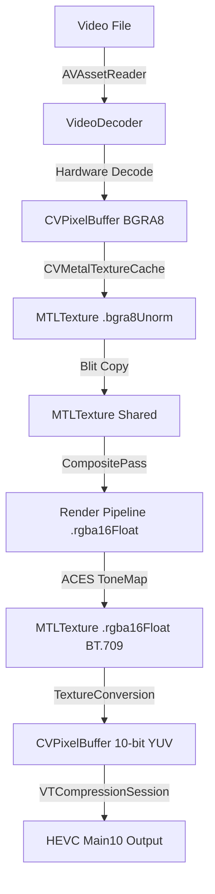

# Research Note: Core Video Pipeline

**Source Documents:**
- `VIDEO_PIPELINE_FLOW.md` (45KB)
- `VIDEO_DECODE_STAGE_DEEP_DIVE.md` (41KB)
- `VIDEO_ENCODER_ARCHITECTURE.md` (23KB)
- `10BIT_PIPELINE_ANALYSIS.md` (34KB)

## 1. Executive Summary
The core video pipeline represents a **Zero-Copy, Apple Silicon Native** architecture designed for 10-bit HDR throughput. It leverages `CVMetalTextureCache` to bridge the gap between VideoToolbox (Media Engine) and Metal (GPU) via shared `IOSurface` memory, eliminating costly CPU copies. The pipeline operates internally in 16-bit Float (ACEScg) and encodes to 10-bit HEVC or 8-bit H.264/HEVC with high-quality dithering.

## 2. Architecture Overview

### Critical Path

## 3. Detailed Stage Analysis

### Stage 1: Decode (`VideoDecoder`)
-   **Mechanism:** Uses `AVAssetReader` to drive hardware decoding via VideoToolbox.
-   **Zero-Copy Config:**
    -   Attributes: `kCVPixelBufferMetalCompatibilityKey: true`, `kCVPixelFormatType_32BGRA` (or 420YpCbCr for 10-bit source).
    -   Result: Creates a `CVPixelBuffer` backed by `IOSurface`.
-   **The "Mandatory Blit":**
    -   *Constraint:* AVFoundation reuses `CVPixelBuffers`. If mapped directly to a texture used later in the frame, the decoder might overwrite it.
    -   *Solution:* Perform a fast GPU-side blit (copy) from the cache texture to an independent `.shared` memory texture.
    -   *Cost:* ~5.4ms/frame (vs 15-20ms CPU copy).
-   **Multi-Source Management:**
    -   `MultiSourceDecoder` manages a pool of decoders via LRU eviction.
    -   **Parallel Decoding:** Uses `TaskGroup` to decode multiple streams (e.g., Multicam) concurrently, leveraging the Media Engine's high throughput.
    -   **Memory Budget:** Auto-limited to ~10% of physical RAM.

### Stage 2: Color Space & Compositing
-   **Input State:** Video is typically BT.709/sRGB Gamma.
-   **Internal State:** `ACEScg` Linear (unbounded).
-   **Conversion:**
    -   Video textures must be linearized (`sRGB -> Linear`) before blending. *Note: Docs mention this was a known gap in one version.*
    -   Graphics/VFX generated continuously in Linear.
-   **Output Prep:**
    -   **Tone Mapping:** ACES RRT+ODT applied at end of frame.
    -   **OETF:** BT.709 transfer function (Gamma ~2.4->0.45 correction) applied for display encoding.

### Stage 3: YUV Conversion & Encode (`VideoExporter`)
This is the most complex stage due to format handling.

#### Data Flow (10-Bit Path - Preferred)
1.  **Input:** `rgba16Float` Linear Buffer.
2.  **Shader:** `convert_rgba16float_to_yuv10_zerocopy`.
    -   **Matrix:** Uses **Column-Major** BT.709 Matrix (Critical Fix: Transposed from standard definition).
    -   **Range:** Maps [0,1] to Video Range (Y: 64-940).
    -   **Subsampling:** Reduces chroma to 4:2:0.
3.  **Target:** `CVPixelBuffer` (Format: `kCVPixelFormatType_420YpCbCr10BiPlanarVideoRange`).
    -   **Method:** Compute shader writes *directly* to the Metal texture view of this CVPixelBuffer.
4.  **Encoder:** `VTCompressionSession` (VideoToolbox).
    -   Config: `kVTProfileLevel_HEVC_Main10_AutoLevel`.
    -   Benefit: True 10-bit HDR, no AVFoundation 8-bit bottleneck.

#### Data Flow (8-Bit Path - Compatibility)
1.  **Fallback:** Used if Hardware < M1 or user requested (Social Media).
2.  **Dithering:** Blue-noise dither applied in shader before quantization to 8-bit to prevent banding.
3.  **Encoder:** `AVAssetWriter`.
    -   Limitation: Often silently downconverts to 8-bit even if fed 10-bit buffers.

## 4. Operational Best Practices
-   **Build Validity:** Ensure `kVTProfileLevel_HEVC_Main10_AutoLevel` exists in SDK (requires newer Xcode/macOS).
-   **Texture Storage:** Use `.shared` for debug readback, `.private` for internal passes. Using `.private` + `.getBytes()` causes instant crash.
-   **Async Encoding:** Run encoding in a separate Task/Queue with a semaphore (depth 3) to allow CPU/GPU overlap.

## 5. Known Traps & Fixes
| Issue | Symptom | Root Cause | Fix |
|-------|---------|------------|-----|
| **Blue/Orange Swap** | Colors look alien | Matrix Row/Col Major mismatch | Transpose RGB->YUV matrix in Metal. |
| **Banding ** | Stepping in smooth gradients | 8-bit Quantization | Use 10-bit Path OR Blue-noise Dither. |
| **Crash on Export** | SIGSEGV | `.getBytes()` on `.private` texture OR 10-bit CVPixelBuffer stride mismatch | Use Zero-copy write (compute shader) or `.shared` staging texture. |
| **Dark Video** | Composite looks washed out | Gamma video blended in Linear space | Apply `sRGB_to_Linear` on video texture before composite. |

## 6. Optimization Metrics (M1 Max)
-   **Decode:** <1ms (Hardware).
-   **YUV Convert:** <1ms (Compute).
-   **Encode:** 10-20ms (Hardware).
-   **Total Throughput:** Easily sustains 4K60.
-   **Bandwidth Savings:** ~1.3 GB/s saved via Zero-Copy.
