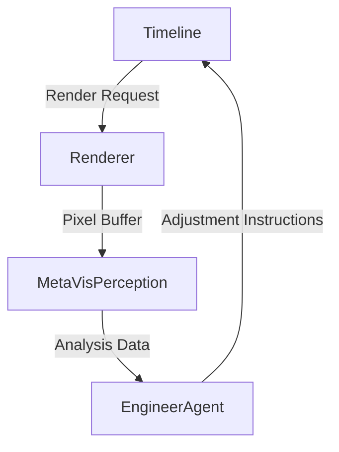

# Specification: MetaVis Perception (Phase 3)

**Goal:** Give the "AI Media Engineer" eyes. The system must be able to "watch" the video content to make intelligent decisions about Color, Framing, and Content.

## 1. Architectural Role
`MetaVisPerception` acts as the **Visual Cortex**. It does not modify images (that's `MetaVisGraphics`). It consumes pixel buffers and emits **Metadata**.



## 2. New Components

### 2.1. `VideoAnalyzer`
A stateless service (similar to `LoudnessAnalyzer`) that accepts a `CVPixelBuffer` or `MTLTexture` and returns statistical knowledge.

- **Technologies:** Metal Performance Shaders (MPS), Vision Framework.
- **Key Metrics:**
  - **Color Statistics:** Histogram, Average Color (RGB), Luma Variance (Contrast).
  - **White Balance:** Tint/Temp estimation using Grey World assumption or skin-tone heuristics.
  - **Saliency:** Center of attention (ROIs) for Smart Crop.

### 2.2. `VisionGovernance`
Policy definitions for visual standards.

- `ColorGovernance`: e.g., "Broadcast Safe" (Rec.709 limits), "Netflix HDR".
- `FramingGovernance`: e.g., "Face Priority" (Faces must be in upper 3rd).

### 2.3. Agent Integration (`EngineerAgent` Extension)
The Agent will use these eyes to perform specific "Jobs":

1. **Auto-Colorist:**
   - *Observation:* "Contrast is low (Luma Variance < 0.1), Highlights are clipping."
   - *Action:* Apply S-Curve, reduce Gain.
2. **Safety Officer:**
   - *Observation:* "Red saturation exceeds Broadcast limits."
   - *Action:* Apply Desaturation or Soft Clip.

## 3. Data Structures

```swift
public struct VideoAnalysis: Sendable {
    public let dominantColors: [SIMD3<Float>]
    public let lumaHistogram: [Float] // 256 bins
    public let skinToneLikelihood: Float // 0..1 confidence
    public let faces: [CGRect] // Normalized coordinates
}
```

## 4. Implementation Strategy (MVP)
We will focus on **Color Statistics** first, as it enables the "Auto-Colorist" feature which parallel's the Audio "Auto-Leveling".

1. **Bit-Exact Determinism:** Like the Audio engine, analysis must be deterministic.
2. **Downscaling:** Analyze low-res proxies (e.g., 256x256) for speed.
3. **Frame Sampling:** For long clips, sample the "Center Frame" or keyframes, rather than every frame.
