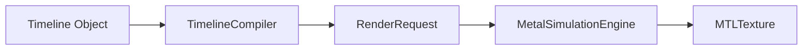

# MetaVisSimulation

**MetaVisSimulation** is the high-performance rendering engine. It executes the node graphs produced by the `MetaVisTimeline` model.

## Features

- **Metal Backend:** Fully GPU-accelerated pipeline (`MetalSimulationEngine`).
- **Graph Compilation:** Turns user timelines into optimized, directed acyclic graphs (DAGs) of render nodes.
- **Color Managed:** Native ACEScg linear workflow.
- **Procedural Extension:** Supports "LIGM" (Procedural) assets like `ligm://fx_nebula` alongside standard video.

## Internal Dependencies
- **FFmpeg:** Currently requires `ffmpeg` to be in the PATH for decoding **EXR stills** inside `ClipReader` (via `FFmpegEXRDecoder`). FITS decoding is already native/pure Swift.
- **Metal Library:** Expects `MetaVisGraphics` resources to be bundled. Falls back to runtime string compilation if missing.

## Usage

