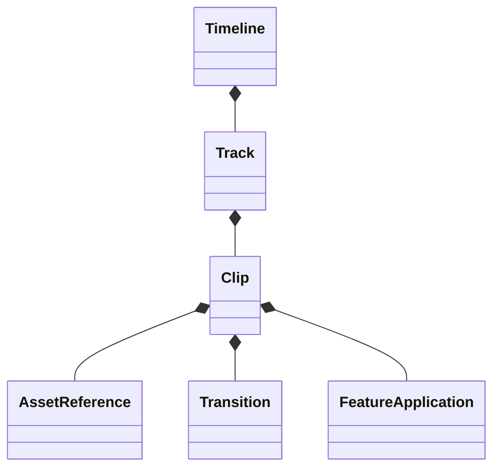

# MetaVisTimeline

**MetaVisTimeline** defines the serializable data model for the MetaVis Non-Linear Editor (NLE).

## Design Philosophy

- **Value Semantics:** All models are `structs`. State mutations are done by replacing the entire timeline object (functional updates), which simplifies Undo/Redo systems.
- **Codable:** The entire timeline can be serialized to JSON trivially.
- **Unit Independent:** Uses `MetaVisCore.Time` for high-precision, framerate-independent timing.

## Extensions

- **Timeline+Duration:** Helper to recompute the total duration based on the max extent of clips.

## Usage

