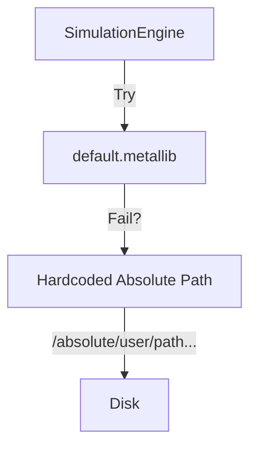

# Sprint 24d: Architecture - The Hardened Engine

## Current vs Target State

### 1. Image Decoding Pipeline

**Current:**
```mermaid
graph LR
    ClipReader -->|Try| Native[CoreImage/ImageIO EXR]
    Native -->|Success| Texture
    Native -->|Fail (no codec)| FFmpeg[ffmpeg CLI fallback]
    FFmpeg -->|File| RawBytes
    RawBytes -->|CVPixelBuffer| Texture
```

**Target:**
```mermaid
graph LR
    ClipReader -->|Direct Link| TinyEXR[tinyexr (C)]
    ClipReader -->|Direct Link| FITSReader[FITSReader (pure Swift)]
    TinyEXR -->|Memory| Texture
```

### 2. Shader Loading Strategy

**Current (Broken):**


**Target (Portable):**
```mermaid
graph TD
    Engine -->|Load| BundleHelper[GraphicsBundleHelper]
    BundleHelper -->|Locate| Bundle[Metal Library]
    
    subgraph Failure Mode
    Bundle -->|Missing?| Error[Fatal Error (Production)]
    end
```

## Module Impact

| Module | Change |
| :--- | :--- |
| `MetaVisSimulation` | **P0:** Replace `FFmpegEXRDecoder` (EXR-only). **P0:** Remove absolute paths in `MetalSimulationEngine`. |
| `MetaVisGraphics` | **P0:** Verify `GraphicsBundleHelper` for SPM vs App logic. |
| `MetaVisCore` | (No major changes; API Key refactor moved to Sprint 4). |
