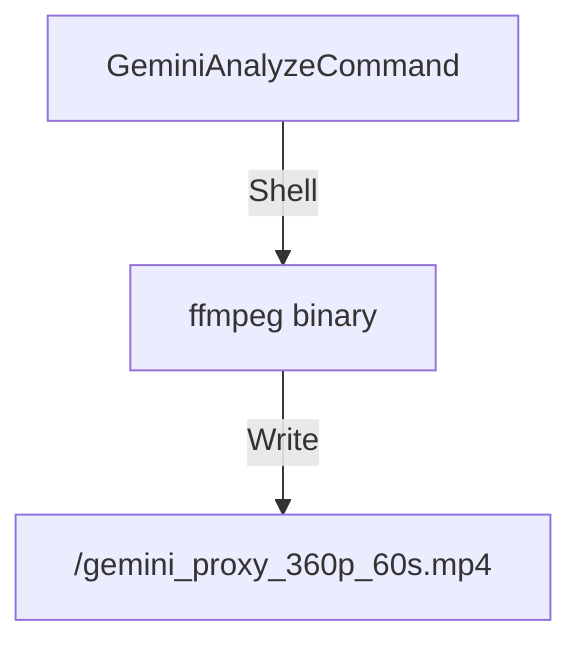
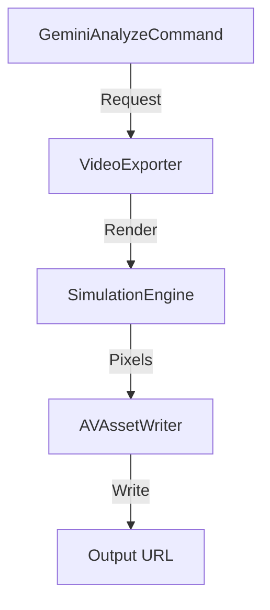

# Sprint 24e: Architecture - Unified IO

### 1. Unified Export Implementation

**Current (Ad-Hoc, 2025-12-22):**


**Current repo reality notes:**
- `GeminiAnalyzeCommand` creates a 60s ~360p proxy by invoking `ffmpeg` and writing into the command’s output directory.
- Other Lab commands also invoke `ffmpeg` (transcript trimming, EXR extraction helpers). This sprint targets Gemini proxy generation first.

**Target (Unified):**


### 2. Generative Plugin System

**Interface:**
```swift
protocol GenerativeSourcePlugin: Sendable {
    var id: String { get }
    var supportedSchemes: [String] { get } // e.g. ["noise", "perlin"]
    func generate(prompt: String, params: [String: NodeValue]) async throws -> AssetReference
}
```

**Component:** `LIGMDevice` holds a registry `[String: GenerativeSourcePlugin]`.

## Module Impact

| Module | Change |
| :--- | :--- |
| `MetaVisLab` | **P0:** Refactor `GeminiAnalyzeCommand` to function `async` and use `VideoExporter`. |
| `MetaVisIngest` | **P1:** Define `GenerativeSourcePlugin`. Implement `NoisePlugin`. Refactor `LIGMDevice`. |
| `MetaVisExport` | (No change; merely consumed). |

**Invariant:** The proxy generation path must use the same rendering pipeline used for final export.
This guarantees **Input (Edit) == Output (Proxy)** and eliminates drift between “preview” and “deliverable”.
