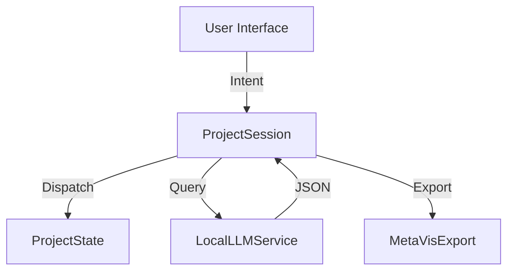

# MetaVisSession

**MetaVisSession** is the application controller layer. It sits between the UI (SwiftUI/UIKit) and the deep engine logic.

## Responsibilities

1.  **State Management:** Holds the `ProjectState` (Timeline + Config) in a thread-safe Actor (`ProjectSession`).
2.  **Undo/Redo:** Automatically tracks history for all dispatched actions.
3.  **Command Interpretation:** Coordinates with `MetaVisServices` to turn text commands ("Make it pop") into timeline edits.
4.  **Export Orchestration:** Configures the `MetaVisExport` pipeline with the correct `Governance` policies based on the user's plan (`EntitlementManager`).

## Architecture

## Recipes
The module includes "Recipes" — templates for creating new projects.
- **SmokeTest2s:** 2 seconds of Bars & Tone.
- **GodTest20s:** 20 seconds of rigorous test patterns (Macbeth, Zone Plate, etc).
