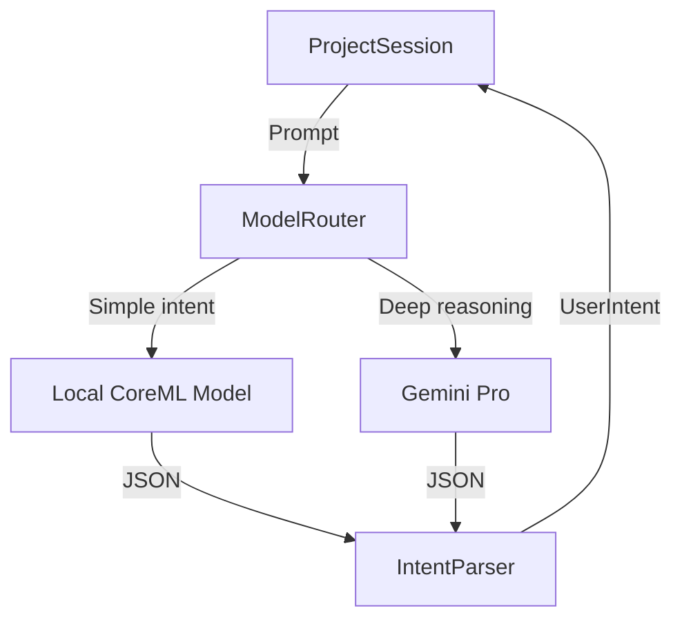
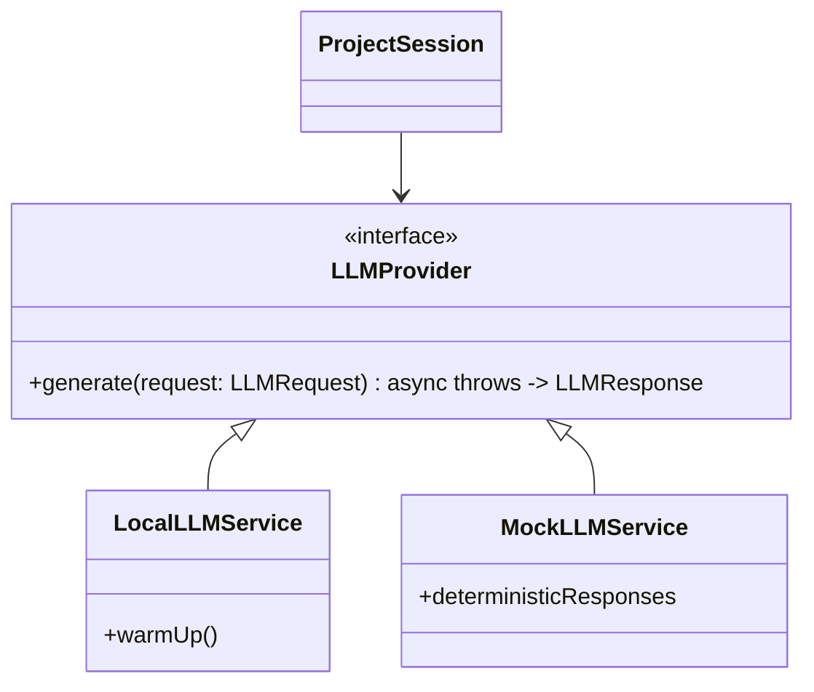
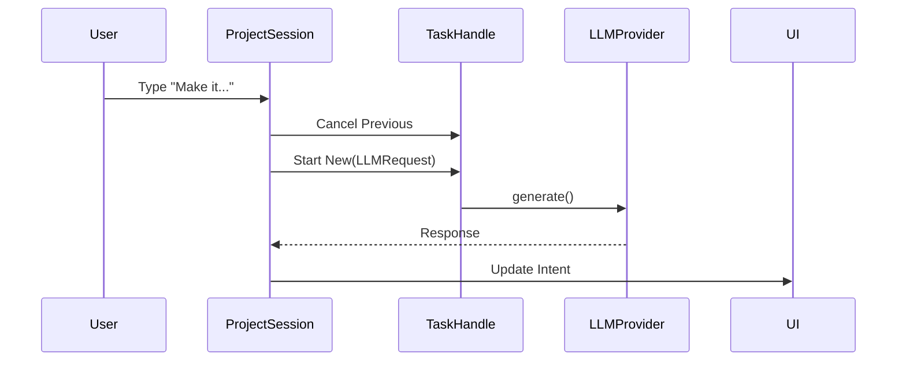

# Sprint 24g: Architecture - Real AI

## 1. The Intelligence Stack

**Current:**
`ProjectSession` -> `LocalLLMService` (Mock) -> `IntentParser` (Regex)

**Target:**


### 1. LLM Abstraction Layer

We need to break the direct dependency on `LocalLLMService` (the concrete actor).



### 2. Request Management (Brain Loop)

**Current:**
Fire-and-forget async calls.

**Target:**


### 3. Multimodal Payload
`GeminiClient` internal structs already support `inlineData` / `fileData`. We just need to expose them in the `GeminiDevice` action interface (e.g. `ask_expert(prompt: String, image: Data?)`).

## 2. Multimodal Data Flow

**Current:**
`GeminiDevice` is a `SimulationDevice` that takes `Text`.

**Target:**
`GeminiDevice` accepts `MultimodalPayload`.
```swift
struct MultimodalPayload {
    let text: String
    let visualContext: [UnifiedImage] // JPEGs or PixelBuffers
    let audioContext: [AudioBuffer]?
}
```
The `MetalSimulationEngine` must be updated to feed this payload when executing a Graph Node that taps into an AI Service.
